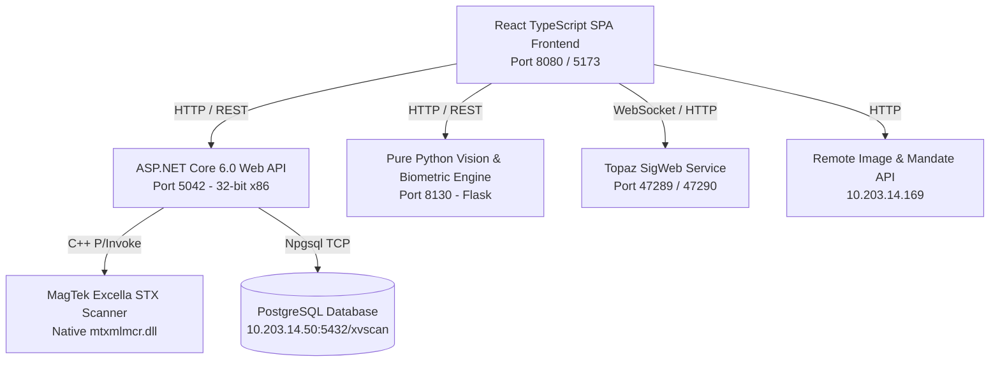

# X100+ Voucher Scanner — Enterprise Client Application

The **X100+ Voucher Scanner** is an enterprise-grade banking workstation application designed for financial institutions, bank branches, and clearing houses. It orchestrates high-throughput optical cheque processing, E-13B MICR codeline extraction, real-time account mandate signature verification, Topaz signature pad ink capture, and 3-track magnetic card telemetry.

---

## 1. System Overview & Purpose

In modern commercial banking and financial operations, tellers and back-office operators require a unified, ultra-reliable platform to digitize physical instruments (cheques, deposit slips, payment vouchers, and debit/credit cards) while immediately validating transaction legitimacy.

### Primary Use Cases
* **Cheque Clearing & Deposit Processing:** High-resolution dual-sided optical scanning (Front & Back) with automated E-13B MICR codeline parsing (Check Number, Routing Transit Number, Account Number, Bank Code).
* **Automated Mandate Signature Validation:** Instant, side-by-side comparison of physical cheque signatures against official core-banking account mandate specimen signatures.
* **Biometric Stroke & Trajectory Analysis:** Real-time multi-algorithmic signature similarity scoring (IoU, Dice coefficient, NCC, ORB keypoint matching, baseline slant, spatial anchoring, and stroke trajectory).
* **Live Topaz Signature Pad Capture:** Digital ink capture from physical Topaz signature pads directly into the verification stream for over-the-counter authorization.
* **Magnetic Stripe Reader (MSR) Telemetry & MagnePrint:** 3-track magnetic card reading, DUKPT encryption, and MagnePrint acoustic waveform scoring for counterfeit card prevention.
* **Archival Storage & Deep Retrieval (Voucher Inspector):** Full transaction archival into PostgreSQL with fast search, structured metadata extraction, and high-resolution JPEG lightbox downloads.

---

## 2. Architecture & Multi-Tier Topology

The system operates across a decoupled, high-performance multi-tier architecture:



### Component Breakdown
1. **Frontend Client (`/frontend`):**
   * Built with **React 18**, **TypeScript**, **Vite**, and **Tailwind CSS**.
   * Standardized on **General Sans** typography.
   * Features Shadcn UI primitives, responsive Bento grids, collapsible right-aside signature validation, and 3D card visualizers.
2. **Hardware & Orchestration API (`/backend/ScannerApi`):**
   * Built with **.NET 6.0 Web API** compiled specifically for **Windows x86 (32-bit)** to interface directly with MagTek’s native C++ driver (`mtxmlmcr.dll`).
   * Handles device state management, automated feeder commands, image binary streams, and database persistence.
3. **Computer Vision & Biometric Engine (`/backend/python_service`):**
   * Pure Python Flask microservice (port `8130`) powered by **OpenCV**, **NumPy**, **SciPy**, and **Tesseract OCR**.
   * Performs automated deskewing, connected-component ink isolation, signature bounding box extraction, and multi-factor biometric comparison.
4. **Physical Signature Capture (Topaz SigWeb):**
   * Connects to Topaz SigLite/SignatureGem physical tablets via local WebSocket for ink streaming.
5. **Database Storage Engine (PostgreSQL):**
   * Stores complete voucher records, images, MICR components, and magnetic tracks in the PostgreSQL database at `10.203.14.50:5432/xvscan` (Table: `mbank_cheques`).

---

## 3. Core Functional Modules

### A. Dual-Mode Document Engine
* **Cheque Mode:**
  * Dual-side optical scanning (Front & Back) in full color (24-bit RGB) or grayscale.
  * Hardware-level E-13B MICR reading with automated checksum and formatting fallback.
  * Vision OCR parsing for numerical amount, amount in words (legal amount), date, payee, and bank branch.
* **Card Mode (MSR):**
  * Reads Track 1 (IATA), Track 2 (ABA), and Track 3 (Thrift) data simultaneously.
  * MagnePrint dynamic waveform reading and scoring.
  * Free-standing interactive 3D CSS Card with chip, contactless indicators, brand identification (Visa/Mastercard/Amex), and flip diagnostics.

### B. Instant Signature Validation & Interactive Cropping
* **Automatic Right-Aside Comparator:**
  * Integrated directly into the main workspace as a right aside (Cheque signature on top, Mandate specimen signatures below).
  * Auto-collapses after 30 seconds of inactivity, but dynamically pauses/resets whenever the user hovers, scrolls, or interacts.
* **Precise Ink Extraction (Shaved Left ROI):**
  * Default automatic signature cropping focuses on the right section (`x: 0.58, y: 0.52, w: 0.40, h: 0.30`) to exclude pre-printed account holder text on the left of the signature line.
* **Expanded Full Cheque Signature Mapper:**
  * Full-screen light-theme modal allowing tellers to drag, resize, and fine-tune custom signature bounding boxes on the original scan.

### C. Voucher Inspector & Archival Viewer (`/view`)
* **Header-Integrated Search:** Fast voucher search input inside the navigation bar with instant clear (`X`) and loading indicators.
* **Smart Type Indicator:** Automatically narrows down to display only the single returned document type (`Type: Cheque` or `Type: Card`) upon search completion.
* **Enlarged Lightbox & JPEG Export:** Click-to-enlarge high-resolution lightbox viewer with direct one-click JPEG download capabilities.

---

## 4. Database Architecture (PostgreSQL Transition)

The database persistence layer connects to PostgreSQL:

* **Host:** `10.203.14.50`
* **Port:** `5432`
* **Database Name:** `xvscan`
* **Username:** `postgres`
* **Password:** `usg12345`
* **Connection String:** `pgsql:host=10.203.14.50;port=5432;dbname=xvscan`

> [!NOTE]
> **Oracle Legacy Code:** The previous Oracle database connection logic and credentials in `ScannerController.cs` have been preserved as comments for architectural reference and are not actively executed.

### Database Table Schema (`mbank_cheques`)
All columns are verified and managed automatically by `EnsurePostgresColumns`:

| Column Name | Data Type | Description |
| :--- | :--- | :--- |
| `trans_id` | `VARCHAR(100)` | Unique Transaction / Voucher Number (Primary Key) |
| `image1` | `BYTEA` | Front Cheque Scanned Image (Binary) |
| `image2` | `BYTEA` | Back Cheque Scanned Image (Binary) |
| `narration` | `TEXT` | Transaction Narration / Notes |
| `voucher_type` | `VARCHAR(100)` | Document Type (`CHECK` or `MSR`) |
| `micr` | `TEXT` | Raw E-13B Optical MICR Codeline |
| `cheque_num` | `VARCHAR(20)` | Parsed Cheque Number (Original Column) |
| `acct_no` | `VARCHAR(100)` | Account Number extracted from MICR/Mandate (Original Column) |
| `routing_number` | `VARCHAR(100)` | Routing Transit Number |
| `bank_code` | `VARCHAR(15)` | Bank Code |
| `country_code` | `VARCHAR(50)` | Sierra Leone Country Code (SL MICR) |
| `state_code` | `VARCHAR(50)` | Sierra Leone State/Region Code (SL MICR) |
| `branch_code` | `VARCHAR(50)` | Sierra Leone Branch Code (SL MICR) |
| `transaction_code` | `VARCHAR(50)` | Sierra Leone Transaction Code (SL MICR) |
| `check_date` | `VARCHAR(100)` | Cheque Issue Date |
| `amount` | `VARCHAR(10)` | Transaction Amount in Figures |
| `amount_words` | `TEXT` | Transaction Amount in Words |
| `account_holder` | `VARCHAR(200)` | Payee / Account Holder Name |
| `signature` | `TEXT` | Cropped Signature Base64 Payload |
| `track_data1` | `TEXT` | MSR Track 1 Data |
| `track_data2` | `TEXT` | MSR Track 2 Data |
| `track_data3` | `TEXT` | MSR Track 3 Data |
| `mp_data` | `TEXT` | MagnePrint Waveform Data |
| `card_type` | `VARCHAR(50)` | Card Brand / Type |
| `magne_print_status` | `VARCHAR(50)` | MagnePrint Security Validation Status |
| `track1_status` | `VARCHAR(50)` | Track 1 Read Status |
| `track2_status` | `VARCHAR(50)` | Track 2 Read Status |
| `track3_status` | `VARCHAR(50)` | Track 3 Read Status |
| `get_score` | `VARCHAR(50)` | MagnePrint Confidence Score |
| `device_serial_number` | `VARCHAR(100)` | MagTek Scanner Serial Number |
| `dukpt_serial_number` | `VARCHAR(100)` | DUKPT Encryption Key Serial Number |
| `encrypted_session_id` | `VARCHAR(200)` | Session Cryptographic ID |

---

## 5. API Reference & Endpoint Directory

### A. ASP.NET Core Backend (`/api/scanner` — Port 5042)
* `GET /api/scanner/devices`: Enumerates connected MagTek Excella STX devices.
* `GET /api/scanner/status`: Queries live device health and connection state.
* `POST /api/scanner/connect`: Connects to the default scanner device (`STX.STX001`).
* `POST /api/scanner/connect/{deviceName}`: Connects to a specific named device.
* `POST /api/scanner/set-doctype/{docType}`: Toggles hardware scanning mode (`CHECK` or `MSR`).
* `POST /api/scanner/scan`: Triggers physical scan and returns MICR, Track data, and base64 images.
* `POST /api/scanner/save`: Persists the complete 28-field voucher record into PostgreSQL.
* `GET /api/scanner/view/{transId}`: Fetches complete saved voucher metadata and merged images.

### B. Python Computer Vision Engine (Port 8130)
* `GET /health`: Health check and engine status.
* `POST /crop-signature`: Extracts signature bounding box with optional custom ROI mapping.
* `POST /compare-signatures`: Compares two signature base64 images using 8-factor biometric algorithms.
* `POST /extract-cheque-data`: Executes OCR field extraction (amounts, date, payee, MICR).

### C. External Banking APIs
* `GET http://10.203.14.169/vscanner_api/get_cheque_images-{transId}`: Retrieves remote archival images.
* `GET http://10.203.14.169/vscanner_api/get_account_signatures-{accountNo}`: Fetches account mandate specimen signatures.

---

## 6. URL Routing & Deep Linking

The application supports deep-linking with query parameters for seamless integration with external core banking systems:

* **Scanner Workspace:**
  * `http://localhost:8080/`
  * `http://localhost:8080/?voucherNo=189561`
* **Voucher Inspector (View Page):**
  * `http://localhost:8080/view`
  * `http://localhost:8080/view?voucherNo=189561`

---

## 7. Setup & Development Guide

## 8. Regional MICR Parsing Configuration

The application features a configurable MICR parsing engine in [`frontend/src/config/appConfig.ts`](file:///c:/Users/USG/Downloads/ChequeScannerApp/frontend/src/config/appConfig.ts) to support different regional banking formats without code refactoring:

```typescript
export const appConfig: AppConfig = {
  EXTRACTION_ENABLED: "N",
  SIGNATURE_VALIDATION_ENABLED: "Y",
  MICR_PARSER_FORMAT: "SIERRA_LEONE", // "SIERRA_LEONE" for RC Bank SL, "STANDARD" for Ghana/Global
  API_BASE_URL: "http://localhost:5042",
  OCR_SERVICE_URL: "http://localhost:7007",
  SIGNATURE_SERVICE_URL: "http://127.0.0.1:8130",
};
```

### Supported Formats:
1. **`"SIERRA_LEONE"` (RC Bank Sierra Leone & SL Commercial Banks):**
   * **Component 1 (Cheque Number):** e.g. `03254101`
   * **Component 2 (10-digit Sort Code):** e.g. `0500200004`
     * Digits 1–2 (`05`): Country Code
     * Digits 3–5 (`002`): Bank Code
     * Digits 6–7 (`00`): State Code
     * Digits 8–10 (`004`): Branch Code
   * **Component 3 (Core Account Number):** e.g. `002540080219`
     * **Full Account Number** = Bank Code (`002`) + Branch Code (`004`) + Component 3 (`002540080219`) = `002004002540080219`
   * **Component 4 (Transaction Code):** e.g. `0292582`
2. **`"STANDARD"` (Ghana & International Banks):**
   * Standard 4-component layout: Check Number, Routing Transit Number, Account Number, and Bank Code.

---

## 9. Typography & Design Guidelines
* **Font Family:** **General Sans** loaded via Fontshare CDN (`https://api.fontshare.com/v2/css?f[]=general-sans...`).
* **Design Language:** Enterprise banking light theme with Tailwind CSS, high-contrast badges, bento grids, and smooth micro-animations.